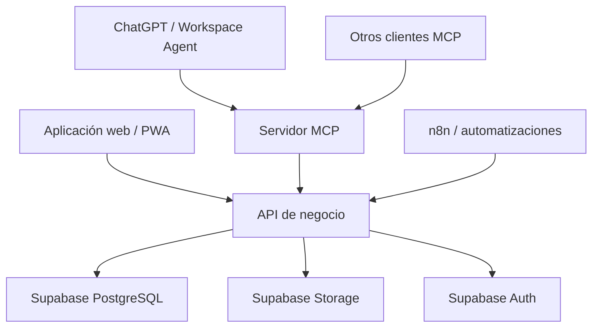

# Plan de implementación — Demo de plataforma empresarial modular con MCP

## 1. Objetivo

Construir una demo comercial reusable de una plataforma multiempresa que permita:

- Administrar clientes, productos, activos, operaciones y documentos.
- Adaptar campos y flujos a diferentes rubros sin modificar continuamente el esquema.
- Conectar los datos y procesos con ChatGPT y otros clientes compatibles mediante MCP.
- Mostrar componentes gráficos interactivos dentro de ChatGPT mediante MCP Apps.
- Configurar un agente experto por empresa sin duplicar el backend.
- Servir como base de un servicio mensual de integración, alojamiento, soporte y asesoría.

El primer tenant de demostración representará un negocio similar a Medcare: cajas de instrumental entregadas temporalmente a hospitales, con remitos, entrega, devolución e inspección.

La demo no debe intentar ser un ERP universal. Debe probar un núcleo reusable y un flujo vertical completo.

---

## 2. Resultado esperado de la demo

Un usuario podrá:

1. Iniciar sesión en la aplicación.
2. Seleccionar una empresa demo.
3. Consultar clientes, cajas e instrumental.
4. Crear y recorrer una operación de préstamo.
5. Generar un remito de salida.
6. Registrar entrega y devolución.
7. Consultar el estado e historial de una caja.
8. Abrir un agente empresarial en ChatGPT.
9. Preguntar por datos reales mediante MCP.
10. Recibir fichas, tablas, indicadores y líneas de tiempo dentro de ChatGPT.

Preguntas clave de la presentación:

- ¿Dónde está la caja `MED-0042`?
- ¿Qué remitos están pendientes de devolución?
- ¿Qué cajas tuvieron mayor utilización?
- ¿Qué hospitales demoran más las devoluciones?
- ¿Qué cajas convendría duplicar?
- Muéstrame la ficha y la línea de tiempo de esta operación.

---

## 3. Arquitectura



### Principio central

La aplicación, MCP y las automatizaciones no contienen reglas de negocio diferentes. Todos utilizan la misma capa de servicios.

El MCP es un adaptador de IA, no un acceso directo a las tablas ni un segundo backend.

---

## 4. Stack recomendado

### Monorepo TypeScript

- `pnpm` con workspaces.
- Turborepo, opcional.
- TypeScript estricto.
- Zod para contratos y validación.

### Aplicación

- Next.js o Vite + React.
- Tailwind CSS.
- shadcn/ui o un sistema visual propio.
- PWA para cámara, QR, firmas y operación móvil.

### Backend

- Supabase PostgreSQL.
- Supabase Auth.
- Row Level Security.
- Supabase Storage.
- API Node.js/TypeScript.
- Edge Functions solamente para tareas pequeñas o integradas con Supabase.

### Inteligencia e integración

- Servidor MCP TypeScript.
- MCP Apps para UI embebida.
- OpenAI Workspace Agent para la experiencia empresarial en ChatGPT.
- n8n para sincronizaciones y automatizaciones no críticas.

---

## 5. Organización del repositorio

```text
apps/
├── web/                    # Panel administrativo y PWA
├── api/                    # API y casos de uso
├── mcp/                    # Servidor MCP
└── mcp-ui/                 # Componentes MCP Apps

packages/
├── auth/                   # Autenticación y contexto de usuario
├── database/               # Cliente, tipos y migraciones
├── domain/                 # Entidades y reglas
├── permissions/            # RBAC y autorización
├── schemas/                # Contratos Zod compartidos
├── documents/              # Numeración y PDFs
├── audit/                  # Eventos y trazabilidad
├── configuration/          # Definiciones por tenant
└── ui/                     # Componentes web compartidos

supabase/
├── migrations/
├── seed.sql
└── tests/
```

---

## 6. Estrategia de datos híbrida

La combinación de columnas estructuradas con `JSONB` es adecuada, pero no debe convertirse en una tabla genérica donde todo vive dentro de un JSON.

### Usar columnas estructuradas para

- Identificadores.
- `organization_id`.
- Relaciones y claves foráneas.
- Códigos y numeraciones.
- Estados.
- Fechas operativas.
- Importes y cantidades.
- Campos filtrados, ordenados o agrupados frecuentemente.
- Datos utilizados por permisos.
- Restricciones de unicidad.
- Información necesaria para reportes.

### Usar `JSONB` para

- Atributos variables según el rubro.
- Preferencias y configuración.
- Campos adicionales definidos por el cliente.
- Metadatos de integraciones.
- Snapshots de documentos.
- Payloads de eventos.
- Respuestas originales de sistemas externos.
- Información que todavía no justifica una tabla propia.

### Regla de promoción

Un atributo debe migrar de `JSONB` a columna o tabla cuando:

- Participa regularmente en filtros o agrupaciones.
- Necesita una restricción o relación.
- Forma parte de permisos.
- Se utiliza en cálculos importantes.
- Requiere indexación estable.
- Aparece en varios tipos de entidad.

### Ejemplo correcto

```sql
create table assets (
  id uuid primary key default gen_random_uuid(),
  organization_id uuid not null references organizations(id),
  asset_type_id uuid not null references asset_types(id),
  code text not null,
  name text not null,
  status text not null,
  current_location_id uuid,
  acquired_at date,
  custom_data jsonb not null default '{}'::jsonb,
  created_at timestamptz not null default now(),
  updated_at timestamptz not null default now(),
  unique (organization_id, code)
);
```

Ejemplo de `custom_data`:

```json
{
  "specialty": "traumatología",
  "sterilization_method": "autoclave",
  "manufacturer": "Demo Medical",
  "replacement_cost": {
    "amount": 8500000,
    "currency": "ARS"
  }
}
```

`status`, `code` y `organization_id` no deben esconderse dentro del JSON.

---

## 7. Definiciones de campos dinámicos

Para que `custom_data` sea personalizable sin volverse caótico, cada tipo de entidad tendrá un esquema registrado.

```sql
create table field_definitions (
  id uuid primary key default gen_random_uuid(),
  organization_id uuid not null references organizations(id),
  entity_type text not null,
  field_key text not null,
  label text not null,
  data_type text not null,
  required boolean not null default false,
  searchable boolean not null default false,
  configuration jsonb not null default '{}'::jsonb,
  sort_order integer not null default 0,
  unique (organization_id, entity_type, field_key)
);
```

Ejemplo:

```json
{
  "entity_type": "asset",
  "field_key": "surgery_specialty",
  "label": "Especialidad quirúrgica",
  "data_type": "select",
  "required": true,
  "configuration": {
    "options": [
      "Traumatología",
      "Neurocirugía",
      "Cardiovascular"
    ]
  }
}
```

La API debe validar `custom_data` contra estas definiciones antes de guardar.

No se deben aceptar objetos arbitrarios sin validación.

---

## 8. Tablas del núcleo

### Identidad y multiempresa

- `organizations`
- `organization_settings`
- `profiles`
- `organization_members`
- `roles`
- `permissions`
- `role_permissions`
- `member_roles`

### Datos comerciales

- `customers`
- `customer_contacts`
- `customer_locations`
- `products`
- `product_categories`
- `price_lists`

### Activos e inventario

- `asset_types`
- `assets`
- `asset_components`
- `locations`
- `stock_items`
- `inventory_movements`

### Operaciones

- `operation_types`
- `operation_statuses`
- `operation_transitions`
- `operations`
- `operation_lines`
- `operation_assets`
- `operation_events`

### Documentos

- `document_types`
- `document_sequences`
- `documents`
- `document_versions`
- `signatures`
- `attachments`

### Personalización e IA

- `field_definitions`
- `workflow_definitions`
- `metric_definitions`
- `agent_profiles`
- `integration_connections`
- `mcp_tool_policies`

### Auditoría

- `audit_log`
- `outbox_events`
- `automation_runs`

---

## 9. Tablas críticas y uso de JSONB

### `organizations`

Columnas:

- `id`
- `slug`
- `name`
- `status`
- `created_at`

JSONB:

- `branding`
- `preferences`

### `customers`

Columnas:

- `id`
- `organization_id`
- `code`
- `legal_name`
- `tax_id`
- `status`

JSONB:

- `custom_data`
- `external_refs`

### `operations`

Columnas:

- `id`
- `organization_id`
- `operation_type_id`
- `customer_id`
- `number`
- `status`
- `expected_start_at`
- `expected_end_at`
- `actual_start_at`
- `actual_end_at`
- `created_by`

JSONB:

- `custom_data`
- `calculated_summary`

### `operation_events`

Debe ser append-only:

- `id`
- `organization_id`
- `operation_id`
- `event_type`
- `occurred_at`
- `actor_id`
- `payload jsonb`
- `previous_hash`
- `event_hash`

Los estados actuales permiten consultas rápidas; los eventos conservan la historia.

### `documents`

Columnas:

- `id`
- `organization_id`
- `document_type_id`
- `operation_id`
- `number`
- `status`
- `issued_at`
- `current_version`

JSONB:

- `snapshot`

El `snapshot` conserva exactamente los datos utilizados para generar el documento, aunque posteriormente cambien el cliente o el activo.

---

## 10. Numeración de remitos

La numeración debe ser transaccional y no debe calcularse con `max(number) + 1`.

```sql
create table document_sequences (
  id uuid primary key default gen_random_uuid(),
  organization_id uuid not null references organizations(id),
  document_type_id uuid not null references document_types(id),
  prefix text not null default '',
  next_number bigint not null default 1,
  padding integer not null default 8,
  unique (organization_id, document_type_id, prefix)
);
```

Una función PostgreSQL debe bloquear la fila, incrementar la secuencia y devolver el número. La creación del documento y la reserva del número deben ocurrir en la misma transacción.

---

## 11. Seguridad

### Reglas obligatorias

- Todas las tablas de negocio incluyen `organization_id`.
- RLS por pertenencia a la organización.
- La API vuelve a validar permisos.
- El MCP no utiliza `service_role` para saltar permisos de usuario.
- Las herramientas reciben contexto autenticado, no `organization_id` libre enviado por el modelo.
- Las escrituras requieren autorización y, cuando corresponda, confirmación humana.
- Los documentos y firmas se almacenan en buckets privados.
- Los enlaces a archivos son temporales.
- No se expone una herramienta de SQL libre.

### Modelo inicial de permisos

```text
customers.read
customers.write
assets.read
assets.write
operations.read
operations.create
operations.transition
documents.read
documents.issue
signatures.capture
analytics.read
admin.configure
```

---

## 12. Vertical demo: instrumental médico

### Tipos

- Cliente: hospital o clínica.
- Ubicación: depósito, hospital, sector o quirófano.
- Activo: caja quirúrgica.
- Componentes: instrumental esperado.
- Operación: préstamo de instrumental.
- Documento: remito de salida.

### Estados

```text
draft
prepared
dispatched
delivered
in_use
collected
inspected
closed
```

### Requisitos por transición

| Transición | Requisitos |
|---|---|
| `draft → prepared` | Caja, cliente, contenido y fechas |
| `prepared → dispatched` | Remito numerado |
| `dispatched → delivered` | Receptor, fecha y firma |
| `delivered → collected` | Responsable de retiro y firma |
| `collected → inspected` | Lista de control, faltantes y daños |
| `inspected → closed` | Resultado final y disponibilidad |

---

## 13. API de negocio

La API debe exponer casos de uso y no acceso genérico a tablas:

```text
GET  /customers
GET  /assets
GET  /assets/:id/history
GET  /operations
GET  /operations/overdue
POST /operations
POST /operations/:id/transitions/prepare
POST /operations/:id/transitions/dispatch
POST /operations/:id/transitions/deliver
POST /operations/:id/transitions/collect
POST /operations/:id/transitions/inspect
POST /documents/:id/issue
GET  /analytics/asset-utilization
```

Cada endpoint:

1. Autentica.
2. Resuelve organización y usuario.
3. Comprueba permisos.
4. Valida entrada.
5. Ejecuta el caso de uso.
6. Registra eventos y auditoría.
7. Devuelve un resultado estructurado.

---

## 14. Servidor MCP

### Primera entrega: solo lectura

Herramientas:

```text
search_customers
search_assets
get_asset
get_asset_history
search_operations
get_operation
get_overdue_operations
get_asset_utilization
get_business_summary
```

### Segunda entrega: borradores

```text
draft_operation
prepare_delivery
prepare_return
generate_management_report
```

### Tercera entrega: acciones confirmadas

```text
create_operation
confirm_delivery
confirm_collection
record_inspection
issue_document
```

### Política

- Herramientas pequeñas y orientadas a objetivos.
- Resultados estructurados.
- Paginación y límites.
- Filtros permitidos.
- Sin SQL arbitrario.
- Herramientas de escritura separadas.
- Confirmación visible para efectos relevantes.

---

## 15. Componentes MCP Apps

Construir cuatro componentes para la demo:

### 1. `asset-card`

- Código y nombre.
- Estado actual.
- Ubicación.
- Operación activa.
- Próxima fecha.
- Acciones para ver historial y remito.

### 2. `operations-table`

- Filtros por estado, cliente y fecha.
- Ordenamiento.
- Selección de una operación.
- Envío de contexto seleccionado al modelo.

### 3. `operation-timeline`

- Preparación.
- Despacho.
- Entrega.
- Retiro.
- Inspección.
- Cierre.

### 4. `utilization-dashboard`

- Cajas más utilizadas.
- Días ocupados.
- Devoluciones demoradas.
- Solicitudes superpuestas.
- Recomendaciones respaldadas por métricas.

Los componentes deben usar primero el estándar MCP Apps. Las extensiones específicas de ChatGPT deben aislarse detrás de adaptadores.

---

## 16. Configuración del agente empresarial

Tabla `agent_profiles`:

```text
id
organization_id
name
description
instructions
enabled_modules
allowed_tool_groups
terminology jsonb
example_prompts jsonb
branding jsonb
```

El agente demo debe:

- Conocer el vocabulario del cliente.
- Consultar herramientas para datos actuales.
- Explicar de dónde obtiene cada respuesta.
- Distinguir hechos, cálculos e inferencias.
- Respetar permisos.
- No inventar movimientos ni métricas.
- Pedir confirmación antes de acciones.

El perfil configura comportamiento; no contiene credenciales.

---

## 17. Datos sintéticos

Crear un tenant demo con:

- 20 hospitales y clínicas.
- 50 contactos.
- 80 cajas.
- 250 instrumentos catalogados.
- 1.500 operaciones históricas.
- 1.500 remitos.
- 30 operaciones activas.
- 8 devoluciones demoradas.
- 12 incidentes.
- 6 casos de demanda no satisfecha.

Los datos deben contener patrones intencionales para que la IA pueda descubrir:

- Dos cajas con utilización superior al 85 %.
- Un hospital con devoluciones sistemáticamente tardías.
- Un tipo de instrumental con faltantes repetidos.
- Estacionalidad.
- Cajas infrautilizadas.

No usar datos reales de Medcare en una demo pública.

---

## 18. Plan de implementación

### Fase 0 — Inventario y recuperación

Duración estimada: 1–2 días.

- Localizar el proyecto Supabase existente.
- Exportar esquema y migraciones.
- Inventariar tablas, funciones, políticas RLS y buckets.
- Identificar elementos reutilizables.
- No modificar la base existente hasta completar la comparación.

Entregable:

- Mapa “reusar, migrar, reemplazar”.

### Fase 1 — Fundación multiempresa

Duración estimada: 4–6 días.

- Monorepo.
- Supabase local y entornos.
- Organizaciones, miembros, roles y permisos.
- RLS.
- Auditoría.
- Tipos compartidos.
- Seed inicial.

Aceptación:

- Dos tenants no pueden verse entre sí.
- Un usuario sin permiso recibe denegación desde RLS y API.

### Fase 2 — Núcleo de negocio

Duración estimada: 6–8 días.

- Clientes.
- Ubicaciones.
- Productos.
- Activos.
- Componentes.
- Operaciones.
- Eventos.
- Campos dinámicos.

Aceptación:

- Puede configurarse un campo personalizado sin migración.
- Los campos estructurales conservan índices, relaciones y validaciones.

### Fase 3 — Flujo Medcare demo

Duración estimada: 5–7 días.

- Estados y transiciones.
- Composición de cajas.
- Entrega y devolución.
- Inspección.
- Remitos numerados.
- PDF básico.
- Firma simulada o capturada.

Aceptación:

- Flujo completo desde borrador hasta cierre.
- Historial inalterable.
- Una caja entregada no aparece como disponible.

### Fase 4 — API y MCP de lectura

Duración estimada: 4–6 días.

- API de casos de uso.
- Autenticación MCP.
- Herramientas de lectura.
- Límites y paginación.
- Logging.
- Pruebas de permisos.

Aceptación:

- ChatGPT responde correctamente las preguntas principales usando datos reales de la demo.

### Fase 5 — MCP Apps

Duración estimada: 5–7 días.

- Ficha de activo.
- Tabla de operaciones.
- Línea de tiempo.
- Dashboard de utilización.
- Integración con herramientas MCP.

Aceptación:

- Los cuatro componentes se renderizan y permiten continuar la conversación.
- Las herramientas siguen siendo útiles en clientes sin UI.

### Fase 6 — Agente y presentación

Duración estimada: 3–4 días.

- Perfil del agente.
- Terminología.
- Preguntas de ejemplo.
- Datos sintéticos definitivos.
- Guion de venta.
- Pruebas de respuestas.
- Video o presentación breve.

### Estimación total

Entre 28 y 40 días efectivos para una implementación individual cuidada. Puede comprimirse a 15–20 días para una demo recortada sin firma completa, PDF avanzado ni acciones MCP.

---

## 19. Alcance de la primera demo

### Incluido

- Multiempresa.
- Roles básicos.
- Clientes.
- Activos.
- Operaciones.
- Estados.
- Eventos.
- Remito numerado.
- Historial.
- Métricas de utilización.
- MCP de lectura.
- Cuatro componentes MCP Apps.
- Agente empresarial demo.

### Fuera de alcance

- Facturación electrónica.
- Contabilidad.
- Firma digital certificada.
- Integración productiva con WhatsApp.
- Optimización de rutas.
- Aplicación móvil nativa.
- Marketplace público.
- Constructor visual universal de workflows.
- SQL libre desde la IA.

---

## 20. Pruebas

### Base de datos

- Aislamiento RLS.
- Secuencias concurrentes.
- Integridad referencial.
- Validación de `custom_data`.
- Índices JSONB necesarios.

### Dominio

- Transiciones válidas e inválidas.
- Disponibilidad de activos.
- Operaciones vencidas.
- Inspecciones incompletas.
- Snapshot de documentos.

### MCP

- Usuario sin autenticación.
- Usuario en tenant incorrecto.
- Herramienta no permitida.
- Paginación.
- Payload excesivo.
- Prompt injection dentro de datos.
- Resultados sin UI.

### UI

- Escritorio y móvil.
- Componentes embebidos.
- Estados vacíos.
- Errores.
- Accesibilidad básica.

---

## 21. Métricas de éxito de la demo

- Configurar un segundo tenant sin duplicar código.
- Agregar un campo personalizado sin migración SQL.
- Consultar una caja en menos de dos interacciones.
- Responder las seis preguntas principales con datos verificables.
- Mostrar cuatro componentes dentro de ChatGPT.
- Cero acceso cruzado entre tenants.
- Cero herramientas con SQL arbitrario.
- Flujo completo de operación demostrable en menos de cinco minutos.

---

## 22. Modelo comercial sugerido

### Implementación inicial

- Relevamiento.
- Importación.
- Configuración de módulos.
- Definición de métricas.
- Personalización del agente.
- Integraciones.
- Capacitación.

### Abono mensual

- Alojamiento.
- Acceso al MCP.
- Mantenimiento.
- Backups.
- Monitoreo.
- Soporte.
- Actualizaciones.
- Automatizaciones incluidas.
- Límites por usuarios, conectores o uso.

El cliente contrata por separado sus licencias de ChatGPT u otro host de IA. Tu producto permanece independiente del proveedor gracias a la API empresarial y MCP.

---

## 23. Primera decisión antes de programar

El siguiente paso debe ser inspeccionar la base Supabase existente y producir una comparación contra este modelo.

No conviene asumir que el esquema anterior debe descartarse ni migrarlo automáticamente. Se debe recuperar:

- Tablas.
- Columnas.
- Claves y relaciones.
- Funciones.
- Triggers.
- Políticas RLS.
- Usuarios y proveedores Auth.
- Buckets y políticas Storage.
- Edge Functions.
- Datos de prueba.

Con esa información se confeccionará:

1. Esquema conservado.
2. Migraciones nuevas.
3. Elementos que requieren refactor.
4. Compatibilidad con el modelo multiempresa.
5. Estrategia para `JSONB`.
6. Plan de importación de Excel.

---

## 24. Decisión arquitectónica resumida

La estructura recomendada es:

> Núcleo relacional estable + extensiones JSONB validadas + eventos append-only + configuración por tenant + API de casos de uso + adaptador MCP + componentes MCP Apps.

Esto conserva la flexibilidad que buscabas con `json_details`, pero evita que datos esenciales queden sin integridad, índices, relaciones o semántica confiable para la IA.

